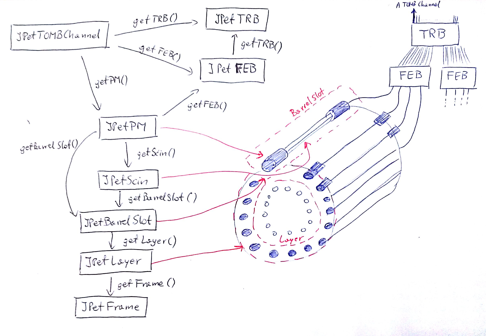
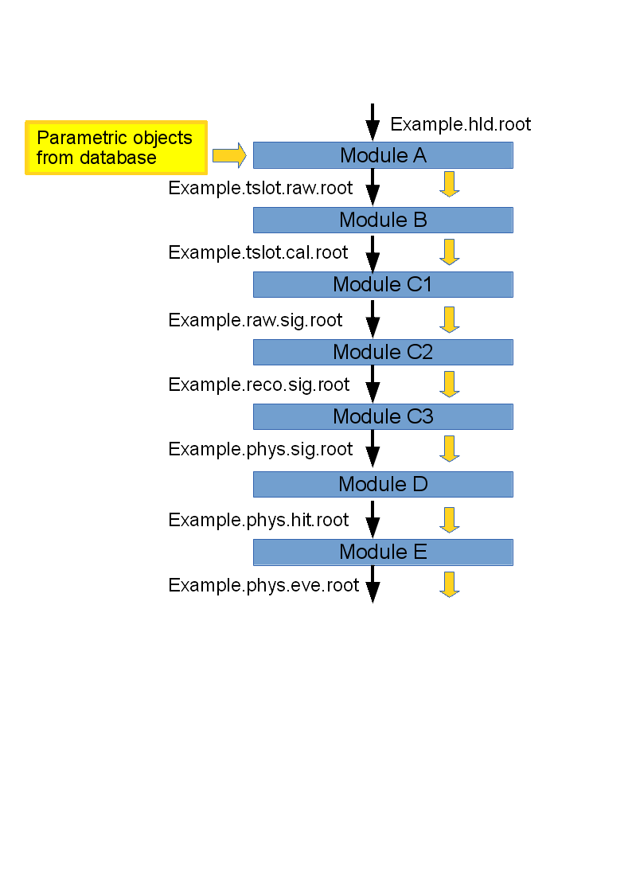

# J-PET SCOPE READER MANUAL

___Document produced on: 29.04.2015___

## Installation:

## Running:

## Preparing analysis:

I order to run analysis creating configuration file is required. Config is parsed using boost::property\_tree library, so it can be written in one of following formats:
+  `.info` dedicated for boost::property\_tree library, [more...](http://www.boost.org/doc/libs/1_58_0/doc/html/property_tree/parsers.html#property_tree.parsers.info_parser)
+  `.json` JavaScript Open Notation, [more...](http://www.boost.org/doc/libs/1_58_0/doc/html/property_tree/parsers.html#property_tree.parsers.json_parser)
+  `.xml`  Extensible Markup Language, [more...](http://www.boost.org/doc/libs/1_58_0/doc/html/property_tree/parsers.html#property_tree.parsers.xml_parser)

**Note!**
Due to configuration structure `.ini` files are not supported.

### Writing configuration file

#### .info format

Configuration structure in .info format:
~~~
config1_name
{ 
    bslot1
    {
        id bslot1_id(int)
        active bslot1_is_active(true/false)
        name bslot1_name(text)
        theta bslot1_theta(float)
        frame bslot1_frame(int)
    }
    bslot2
    {
        ...
    }
    pm1
    {
        id pm1_id(int)
	prefix pm1_prefix(text)
    }
    ...
    pm4
    {
       ... 
    }
    scin1
    {
        id scin1_id(int)
    }
    scin2
    {
        ...
    }
    location data_files_location(text)
    collimator
    {
        positions position(int)
        positions "position_begin(int) position_end(int)"
        positions "position_begin(int) position_end(int) step(int)"
	...
    }
}
config2_name
{
    ...
}
~~~
Exmaple configuration located at workdir/ScopeReaderExample/cfg/example.info .

#### .json format

Configuration structure in .json format:
~~~
{
    "config1_name":
    {
        "bslot1":
        {
            "id": "bslot1_id(int)",
            "active": "bslot1_is_active(true/false)",
            "name": "bslot1_name(text)",
            "theta": "bslot1_theta(float)",
            "frame": "bslot1_frame(int)"
        },
        "bslot2":
        {
            ...
        },
        "pm1":
        {
            "id": "pm1_id(int)",
            "prefix": "pm1_prefix(text)"
        },
        ...
        "pm4":
        {
            ...
        },
        "scin1":
        {
            "id": "scin1_id(int)"
        },
        "scin2":
        {
            ...
        },
        "location": "data_files_location(text)",
        "collimator":
        [
            {
                "positions": "position(int)"
            },
            {
                "positions": "position_begin(int) position_end(int)"
            },
            {
                "positions": "position_begin(int) position_end(int) step(int)"
            }
	    ...
        ]
    },
    "config2_name":
    {
        ...
    }
}
~~~
Exmaple configuration located at workdir/ScopeReaderExample/cfg/example.json .

#### .xml format

Configuration structure in .xml format:
~~~
<?xml version="1.0" encoding="utf-8"?>
<config1_name>
	<bslot1>
		<id>bslot1_id(int)</id>
		<active>bslot1_is_active(true/false)</active>
		<name>bslot1_name(text)</name>
		<theta>bslot1_theta(float)</theta>
		<frame>bslot1_frame(int)</frame>
	</bslot1>
	<bslot2>
		...
	</bslot2>
	<pm1>
		<id>pm1_id(int)</id>
		<prefix>pm1_prefix(text)</prefix>
	</pm1>
	...
	<pm4>
		...
	</pm4>
	<scin1>
		<id>scin1_id(int)</id>
	</scin1>
	<scin2>
		...
	</scin2>
	<location>data_files_location(text)</location>
	<collimator>
		<positions>position(int)</positions>
		<positions>position_begin(int) position_end(int)</positions>
		<positions>position_begin(int) position_end(int) step(int)</positions>
		...
	</collimator>
</config1_name>
<config2_name>
  ...
</config2_name>
~~~
Exmaple configuration located at workdir/ScopeReaderExample/cfg/example.xml .

#### Running the example - Quick start

First, compile the example by issuing (in the `workdir/AnalysisExample` directory:

~~~
make clean && make
~~~

Once the compilation is finished, you can start the analysis by running one of the two scripts:

~~~
./run1.sh
./run2.sh
~~~

The analysis program will run for a few minutes and produce a set of ROOT files as well as a log file called `JPet.log`. When the program finishes, you can open the ROOT files in a TBrowser and view their contents.

#### Command line parameters

Compilation of the example will produce a program called `main.x`. As any other program created with the Framework, it accepts a set of possible command-line parameters:

+  `-h [ --help ]`           produce help message
+  `-t [ --type ] arg`       type of file: hld, root or scope - use __root__ if the input file is an already-unpacked ROOT file (a non-unpacked file would come directly from the DAQ and have a .hld extension); the Framework is capable of unpacking a raw HLD file if you specify the type as __hld__; use __scope__ to automatically create signals from text files from the SDA (this option is not applicable to AnalysisExample, see ScopeReaderExample instead)
+  `-f [ --file ] arg`        File to open - both relative or absolute path can be given
+  `-r [ --range ] arg1 arg2` Range of events to be processed *by the first module in the analsysis chain* - all following modules will process all events provided to them by previous modules; for example `-r 0 9` tells the program to only process first 10 events from the input file; Note that *event* here means a single entry in the ROOT tree - depending on the level of processing it can mean TSlots, Signals, Hit-s, or LOR-s
+  `-p [ --param ] arg`       File with TRB numbers.
+  `-i [ --runId ] arg`       Run id - must be provided if the parametric objects describing the setup should be downloaded from the database before starting first module; __arg__ must be the ID of the run in the database which corresponds to the input data file
+  `-b [ --progressBar ] arg` Display progress bar - if arg is 1, a simple progress indicator will be displayed during processing

#### AnalysisExample - Details

##### Analysis Modules

The data processing is split into steps, each of which is performed by a separate module. Each analysis module is a C++ class inheriting from the base class JPetCommonAnalysisModule. If you look at the contents of the `workdir/AnalysisExample` directory, you will see pair of files called ModuleXY.h and ModuleXY.cpp. While the header files are almost the same for each module, the cpp files contain all the data processing logic.

There are three essential functions inside each module which the user has to implement in order to create an analysis module:

+ begin() - is executed before the processing of events starts; here you can create some empty histograms or initialize any objects which you will need during the analysis
+ end() - is executed after all events in the input tree are processed; here you can manually write your histograms or other objects to the output file (though it can also be done automatically as shown later) or write a summary of the processing to the log file,
+ exec() - this function is called once for every event on the input tree; here you can read objects created by the lower-level analysis modules from the input ROOT tree, use them to construct higher-level objects (e.g. pair 2 PM signals into a hit) and write these new objects to an output tree.

Each module:

+ opens an input ROOT file (which was usually created by the previous executed module) and reads events from a tree in that file,
+ creates an output ROOT file and writes events to a tree in that file; usually this file will be an input for a next module in the chain.

##### The main function

The main function of the program, defined in `main.cpp` starts with creation of the *JPetManager* object which governs whole execution of the analysis. Next, the analysis modules are constructed. A module constructor takes 4 arguments: a name, a description, expected extension of the input ROOT file, and extension of the output ROOT file. When all necessary modules have been constructed, they are added as tasks to process by the Manager. All these modules will be subsequently executed in the same order as they were added. Moreover, the first added module is supposed to open and read from the ROOT file directly provided to the analysis program on the command line. Each following module will try to open and read the ROOT file which was produced by the previous module in the chain. Therefore, when defining your own modules and their order it is important to note that the extension of each module's output file should agree with the extension of the expected input file for the next module in the analysis chain.

You can control which modules are executed by commenting out certain lines in which modules are added to the Manager (of course you have to rebuild the program afterwards). For example, if you have already produced the file `myfile.tslot.cal.root` (which would be produced by ModuleB) and now you want to concentrate on ModuleC, comment out the lines `manager.AddTask(moduleA); manager.AddTask(moduleB);` and rebuild the program. You can then start the program as `./main.x -t root -f myfile.tslot.cal.root` (note the different file extension and lack of the `-i` option with respect to what is in the `run1.sh` script). This way the program will start processing from ModuleC.

##### Downloading data from the database

The program must download information on the setup corresponding to the provided data from the parameters database. This is done if the `-i run_id` option is used. Then, the parametric data id downloaded before execution of the first analysis module. Each module can access the parameters through the *JPetParambank* object, whose instance is accessible with the `getParamBank()` method. At the end of execution, each module writes the Param Bank to its output file so that next modules can read the Parameters Bank from the ROOT file instead of accessing the database again.

In the AnalysisExample, Module A must be executed with a working Internet connection so that database can be accessed, and you must provide an ID of the appropriate run with the `-i run_id` option. However, once the output file of ModuleA is created (*\*.tslot.raw.root*), it already contains the Parameters Bank. If you now comment out adding ModuleA to the analysis chain (see previous section) you can start the analysis from the higher-level modules and new connections to the database will not be needed.

##### The Parametric Objects

The setup parameters downloaded from the database are stored in the *JPetParamBank* object, which contains lists of objects which represent elements of the experimental setup:

+ *JPetTOMBChannel* - represents a single DAQ channel and uniquely identifies the photomultiplier, scintillator, Front-End board, TRB board and threshold from which time signals are recorded on this channel
+ *JPetPM* - represents a photomultiplier
+ *JPetScin* - represents a scintillator and contains its dimensions and properties
+ *JPetBarrelSlot* - represents a single "slot" in the PET barrel, i.e. a system of one scintillator strip and two PM-s at its ends (contains its theta angle)
+ *JPetLayer* - represents a layer of slots in the barrel (the barrel can have many layers like in the big J-Pet barrel), contains its radius
+ *JPetFrame* - represents the mechanical frame which contains all layers of the barrel
+ *JPetFEB* - represents a Front-End Board (FEB) which can be KB, MP or MJ board and contains its properties
+ *JPetTRB* - represents a TRB Board and its properties

There should be a 1:1 equivalence between the elements of the experimental setup and the parametric objects, e.g. one JPetPM object is created for each photomultiplier in the setup. The figure below shows a scheme of the parametric objects. Black arrows denote how other objects can be accessed from objects that uniquely identify them, e.g. from a *JPetPM*, its attached scintillator can be found with the `getScin()` method.

The parametric objects and connection between them can be used to merge lower-level events into higher-level ones - for example, if you have two signals from photomultipliers, represented by the *JPetPhysSignal* objects, you can check whether they correspond to the same scintillator by:

~~~c
 if( signal1.getPM().getScin() == signal2.getPM().getScin() ){
   //this is a hit!
   }
~~~

##### Modules in the AnalysisExample

This example analysis is split into 7 modules. Note, however, that your data processing can be organized in a different way and in general any number of modules may be defined and used. A short description of each analysis module from the AnalysisExample is given below and schematically shown in the figure.

+ __ModuleA__ reads a raw unpacked data file which basically contains only channel numbers and their corresponding times from TDC-s on the TRB board. Module A wraps them into *JPetSigCh* (Signal-Channel) objects. A basic event on this level is a Time Slot, i.e. one time window (of the width of 20 microseconds) from the TDC. The *JPetSigCh* objects are packed into *JPetTSlot* objects which represent time windows. Moreover, ModuleA uses the TOMB Channel (i.e. global DAQ channel number - these are the channel numbers that are stored in data) to recognize whether the TDC time was from leading or trailing edge of the signal and from which threshold it came. The file produced by ModuleA has the extension tslot.raw.root and contains a ROOT tree of *JPetTSlot* objects, each of which contains some number of *JPetSigCh* objects. The logic of ModuleA is quite universal and is should not be necessary to modify it in most cases.

+ __ModuleB__ shows a simple example of *applying* (not calculating) a calibration of TDC times. If simply reads the *JPetTSlot*-s produced by ModuleA, and for each *JPetSigCh* in a TSlot it applies a dummy calibration of its time value. Its output is again a ROOT tree of TSlots, in a file with tslot.cal.root (from *calibrated* TSlot) extension.

+ __ModuleC1__ groups the *JPetSigCh*-s into raw signals from photomultipliers. As one SigCh corresponds to a time of signal crossing a single threshold, the *JPetRawSignal* is described by two sets of SigCh-s, ones set for each  signal edge. Presently, the example assumes that there cannot be two signals from the same PM in one TSlot. Thus, it simply groups all SigCh-s which correspond to the same photomultiplier, into one *JPetRawSignal*. Raw signals created this way are written to the output tree (file extension raw.sig.root) - note that here the definition of "event" in a tree changes from a *JPetTSlot* to a *JPetRawSignal*.

+ __ModuleC2__ reads one JPetRawSignal at a time and reconstructs its properties like delay, amplitude, charge and offset, and stores them in a *JPetRecoSignal* object. The output file (extension reco.sig.root) contains a tree of *JPetRecoSig* objects. Note that reconstruction methods used in this module are just dummy examples.

+ __ModuleC3__ transforms a JPetRecoSignal object to a JPetPhysSignal object, which has completely reconstructed physical properties such as time of arrival at PM and number of photoelectrons. Note that reconstruction methods used in this module are just dummy examples. The output file (extension phys.sig.root) is a tree of such "physical" signals, but still not paired into gamma hits.

+ __ModuleD__ performs pairing of the *JPetPhysSignal*-s into pairs of signals from opposite sides of a scintillator, which constitute a gamma hit. To do this, ModuleD reads from the input tree all PhysSignals which correspond to the same Time Slot (by checking the `JPetPhysSignal::getTSlotIndex()` method) and among them searches for pairs which `getPM().getScin()` returns the same scintillator object (see the section on parametric objects). If the two  signals come from opposite sides of this scintillator, that are used to create a *JPetHit* object. The output file (extension phys.hit.root) contains a tree of *JPetHit* objects.

+ __ModuleE__ performs pairing of *JPetHit*-s into *JPetLOR* objects in a similar manner as pairing in ModuleD. A LOR object is composed of two Hits in different scintillators. ModuleE is also the place to perform reconstruction of time difference between the hits and the position along Line Of Response, for each found pair of the *JPetHit*-s. The output tree contains *JPetLOR* objects.

## Creating your own analysis

In order to create you own analysis program, it is easiest to copy the `AnalysisExample` directory to a new directory in `j-pet-framework/workdir` and start modifying the present modules. Start from ModuleB and higher as ModuleA should work properly in case of most input data and it prepares the data structures which you will need later. If you add your own modules, remember to add their names to the `SRC_MODULE` list in the `Makefile` and to the `LinkDef.h` file. If you change a module and the way it processes data, you can increase the number defined as `MODULE_VERSION` in the module header file. This version number will be stored in the data files to indicate which version of a module was used to produce the data file.

## Useful functionalities

### Adding your own histograms

You may want to create some histograms (or other objects from ROOT, or even some integer variables to count something) and fill them event-by-event during analysis. There are two ways to do it in an analysis module.

#### The easy way

This is mostly convenient for a small amount of 1D or 2D histograms. In the begin() function you can register histogram objects (or anything derived from TObject) with the following method:

~~~c
addStatsObject(TObject *);
~~~
Suppose you want to create a 1D histogram of *time*. Do:

~~~c
addStatsObject(new TH1F("time","time",10,0,10));
~~~
Now you are able to access this histogram by its name from the exec() function like this:

~~~c
getHisto1D("time")->Fill(some_time);
~~~
Similarly, you can access 2D histograms with `getHisto2D(name)`. Other ROOT objects can be retrieved with `getStatsObject(name) `. Note that if you provide a name of a non-existing object, these methods will return NULL!

The advantage of this approach is that everything you register with `addStatsObject()` will be automatically saved in the output ROOT file.

#### The powerful way

The easy way does not require editing the module header file nor manual saving in the ROOT file. However, if you want to use some more complicated structures or have a whole lot of histograms, it may be better for you to create them and save manually. To do this, you should:

+ add variables in the class definition (in the header file), in the private section
+ initialize them in the begin() function
+ now they will be accessible from the exec() function and you can fill them
+ in the end() function write the variables to the output file using `fWriter. writeObject(TObject*)` or by opening your own ROOT file and writing to it. Scalar types like int or double cannot be saved like this, but you can write their values to the log file (see next section).

### Writing to the log file

From anywhere in the analysis modules you can write arbitrary text to the log file, using one of the following macros, depending on the severity of your message:

+ INFO(const char *)
+ WARNING(const char *)
+ ERROR( const char *)

If you want to print out values of some variables, use the `Form` function from ROOT which lets you format a text string similarly as good old `sprintf`:

~~~~c
INFO( Form("I am logging the value of x: %d", x) );
~~~~
